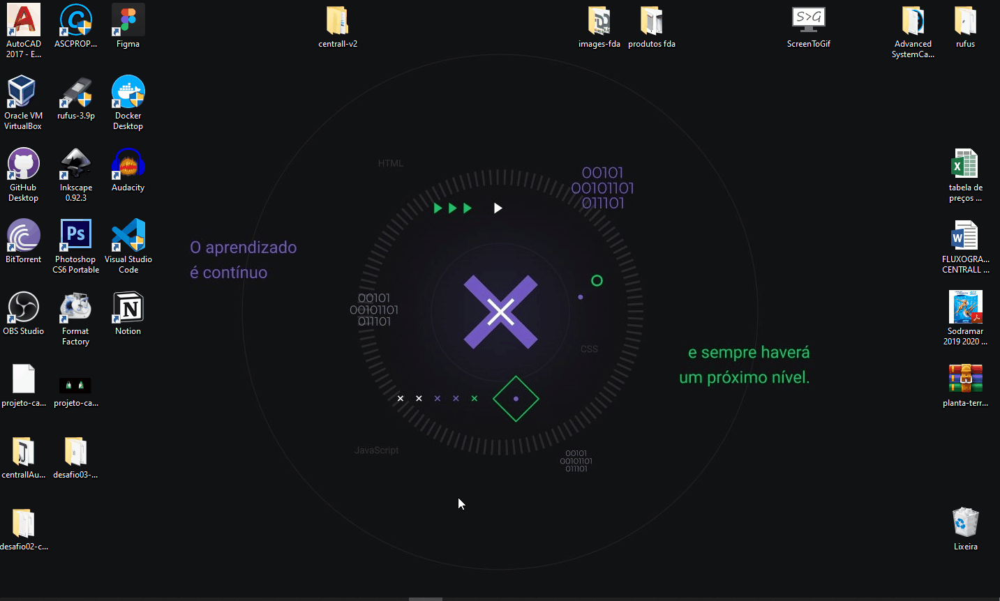

<h3 align="center">
  Desafio 03: Conceitos do ReactJS
</h3>

<blockquote align="center">“Faça seu melhor, mas sempre com prazo de entrega”!</blockquote>

  

  

---

## Demonstração:

  

## :rocket: Sobre o desafio

A aplicação deve ser capaz de armazenar e remover repositórios do do portfólio do backend que foi desenvolvido no desafio 02.

---

Feito com 💜 by Teuuz1994 :wave:
